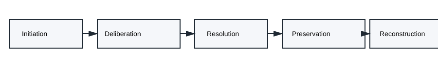
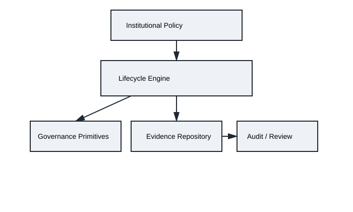

# Decision Governance Infrastructure (DGI)

## A Vendor-Neutral Framework for Institutional Decision Accountability

[](https://creativecommons.org/licenses/by/4.0/)
[](docs/ISO-GAPS-IN-EXISTING-STANDARDS.md)

**Version 2.0 | February 2026**

> For implementation details, API specifications, and production deployment guidance, see [README.Implementation.md](README.Implementation.md).

---

## Overview

Decision Governance Infrastructure (DGI) defines a vendor-neutral framework for treating institutional decisions as auditable lifecycle artifacts. The framework introduces governance primitives that enable organizations to preserve procedural integrity, decision provenance, and evidentiary continuity under regulatory, legal, or adversarial scrutiny.

DGI complements existing governance standards — including ISO 31000:2018 (Risk management), ISO 15489-1:2016 (Records management), and ISO/IEC 42001:2023 (AI management systems) — by addressing a specific gap: **no existing standard defines a structured evidence infrastructure for the decision act itself.**

---

## Motivation

Modern institutions face increasing accountability requirements for AI-assisted decisions. The EU AI Act (Regulation (EU) 2024/1689), the NIST AI Risk Management Framework, and ISO/IEC 42001:2023 all establish governance obligations — yet none prescribe how the procedural lineage of a decision is captured, preserved, and reconstructed when challenged.

DGI addresses this gap by formalizing **five governance primitives** that represent the irreducible evidentiary requirements for decision reconstruction:

| Primitive | Name | Governance Question | Adjacent Standards |
|-----------|------|---------------------|-------------------|
| A | **Context Capture** | What information was available at decision time? | ISO 15489-1, EU AI Act Art. 12 |
| B | **Deliberation Traceability** | What alternatives were considered and why? | NIST AI RMF Map function |
| C | **Override Accountability** | Who made the final decision and on what basis? | ISO/IEC 42001 A.8.4, EU AI Act Art. 14 |
| D | **Evidence Integrity** | Can the record be proven unaltered? | ISO/IEC 27001 A.8.10, eIDAS |
| E | **Drift Detection** | Has the decision context changed since resolution? | ISO 31000 Clause 6.7, NIST AI RMF Manage |

---

## Framework Specification

The full framework is defined in:

- **[DGI Framework v1.0](DGI-Framework-v1.0.md)** — The core specification: principles, primitives, decision lifecycle architecture, evidence model, governance architecture, and standards alignment (with in-text citations to ISO standards and academic literature)

### Decision Lifecycle

DGI defines a five-phase decision lifecycle, each producing governance artifacts:

**Initiation → Deliberation → Resolution → Preservation → Reconstruction**



### Governance Architecture



---

## Relationship to DCII

The **Decision Crisis Immunization Infrastructure (DCII)** is the reference implementation of DGI. The relationship is analogous to HTTP (protocol) and NGINX (server), or SQL (language standard) and PostgreSQL (engine).

| | DGI (This Framework) | DCII (Reference Implementation) |
|---|---|---|
| **Nature** | Vendor-neutral specification | Production implementation |
| **Primitives** | 5 core (A–E) | 9 total (P1–P9), extending DGI with 4 advanced capabilities |
| **Scoring** | Maturity index (DGMI, 5 levels) | IISS™ (0–1000 quantitative metric) |
| **Technology** | Implementation-agnostic | PostgreSQL, REST API, cryptographic signing |
| **Audience** | Standards bodies, governance architects | Engineering teams, compliance implementers |

For implementation details, see [README.Implementation.md](README.Implementation.md).

---

## Alignment with Existing Standards

DGI is designed to complement — not replace — existing governance structures:

| Standard | DGI Relationship |
|----------|-----------------|
| **ISO 31000:2018** | DGI preserves evidence of how risk-informed decisions were made; ISO 31000 governs the risk assessment itself |
| **ISO 15489-1:2016** | DGI extends records management principles to the decision lifecycle |
| **ISO/IEC 42001:2023** | DGI provides the decision evidence layer that ISO 42001 references but does not specify |
| **ISO/IEC 38507:2022** | DGI operationalizes the AI governance principles ISO 38507 establishes at the board level |
| **ISO/IEC 23894:2023** | DGI captures the decision artifacts that AI risk assessments produce |
| **NIST AI RMF** | DGI maps to Govern, Map, Measure, and Manage functions |
| **W3C PROV-DM** | DGI's evidence model aligns with W3C provenance data model semantics |
| **W3C DPV** | DGI decision artifacts may reference Data Privacy Vocabulary terms for privacy-relevant decisions |

---

## Comparison to Similar Works

The following table positions DGI relative to comparable open governance frameworks and specifications:

| Dimension | DGI | W3C DPV | NIST AI RMF | ISO/IEC 42001 | Generic GRC Tools |
|-----------|-----|---------|-------------|---------------|-------------------|
| **Focus** | Decision evidence infrastructure | Privacy vocabulary | AI risk lifecycle | AI management system | Operational compliance |
| **Decision-level artifacts** | Yes (core purpose) | No (data-level) | Partial (guidance) | Partial (control objectives) | No |
| **Formal primitive model** | Yes (5 primitives) | Yes (vocabulary terms) | Yes (4 functions) | Yes (controls annex) | Varies |
| **Lifecycle architecture** | Yes (5 phases) | No | Partial | Partial | No |
| **Vendor-neutral** | Yes | Yes | Yes | Yes | Varies |
| **Quantitative scoring** | Yes (DGMI / IISS™) | No | No | No (binary certification) | Varies |
| **Evidence reconstruction** | Yes (core capability) | No | No | No | No |
| **Standards submission track** | ISO/IEC JTC 1/SC 42 | W3C Community Group | NIST publication | Published ISO standard | N/A |
| **Complementary to DGI** | — | Yes | Yes | Yes | Possible |

**Key differentiator:** DGI is the only framework that defines decision evidence as a first-class artifact with a structured lifecycle, measurable primitives, and reconstruction capability. Adjacent standards govern risk, privacy, or AI systems — but not the decision act itself.

---

## ISO Standardization Track

DGI is being prepared for submission to **ISO/IEC JTC 1/SC 42** (Artificial Intelligence) as a New Work Item Proposal (NP). Supporting documents:

| Document | Purpose |
|----------|---------|
| [Gaps in Existing Standards](docs/ISO-GAPS-IN-EXISTING-STANDARDS.md) | Demonstrates that no existing ISO standard covers decision evidence artifacts |
| [Global Regulatory Equivalence](docs/GLOBAL-REGULATORY-EQUIVALENCE.md) | Maps DGI to 23 jurisdictions across 7 regions |
| [Non-Duplication Proof](docs/NON-DUPLICATION-PROOF.md) | Systematic comparison against 14 existing standards |
| [Scope Boundaries](docs/SCOPE-BOUNDARIES.md) | Defines where DGI stops and ISO 42001/38507/23894 begin |
| [Contributors](docs/DGI-Contributors.md) | Expert endorsement register (seeking 5+ countries) |
| [Standards Body Engagement](docs/standards-body-engagement.md) | Engagement strategy for ISO national bodies |

> **DGI is not a risk management system. DGI is a decision evidence infrastructure specification.**

---

## Repository Contents

```
DGI-Framework-v1.0.md                — Core DGI framework specification (this repository's primary document)
README.md                            — Standards / academic overview (this file)
README.Implementation.md             — DCII implementation details, API, and deployment

/docs
  DCII_Framework_v2.1.md             — DCII white paper (reference implementation specification)
  DGI_Framework_v2.md                — DGI v2 extended specification
  DGI-TR-v1.0.md                     — DGI Technical Report v1.0
  primitive-specifications.md        — Detailed specification for each primitive
  compliance-mapping.md              — Regulation-to-primitive matrix
  ISO-GAPS-IN-EXISTING-STANDARDS.md  — Gap analysis vs. 14 ISO standards
  GLOBAL-REGULATORY-EQUIVALENCE.md   — 23-jurisdiction applicability mapping
  NON-DUPLICATION-PROOF.md           — Non-duplication analysis for ISO NP
  SCOPE-BOUNDARIES.md                — Scope boundary definitions
  DGI-Contributors.md                — Expert endorsement register
  standards-body-engagement.md       — ISO national body engagement strategy
  /diagrams
    decision-lifecycle.svg           — Decision lifecycle diagram
    governance-architecture.svg      — Governance architecture diagram

/schemas
  decision-packet.json               — JSON Schema for Decision Packets
  regulators-receipt.json            — JSON Schema for Regulator's Receipt™
  iiss-scoring.json                  — JSON Schema for IISS scoring

/examples
  sample-decision.json               — Example decision packet
  integration-guide.md               — Step-by-step integration guide

/api
  api-spec.yaml                      — OpenAPI 3.0 specification (59 endpoints)
  webhook-spec.md                    — Webhook event documentation
```

---

## Citation

```bibtex
@techreport{rainey2026dgi,
  title     = {Decision Governance Infrastructure: A Vendor-Neutral Framework for Institutional Decision Accountability},
  author    = {Rainey, Stuart},
  year      = {2026},
  version   = {2.0},
  institution = {Datacendia, LLC},
  url       = {https://github.com/datacendia/decision-governance-infrastructure}
}
```

For the DCII reference implementation:

```bibtex
@techreport{rainey2026dcii,
  title     = {Decision Crisis Immunization Infrastructure: A Framework for Auditable AI Governance},
  author    = {Rainey, Stuart},
  year      = {2026},
  version   = {2.1},
  institution = {Datacendia, LLC},
  url       = {https://github.com/datacendia/decision-governance-infrastructure}
}
```

---

## License

This work is licensed under [Creative Commons Attribution 4.0 International (CC BY 4.0)](LICENSE).

You are free to share and adapt this material for any purpose, including commercial, provided you give appropriate credit.

---

**Datacendia, LLC** — *Decision Governance Infrastructure*
